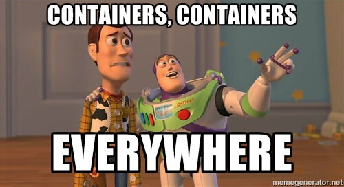
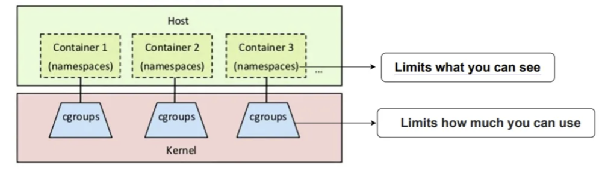
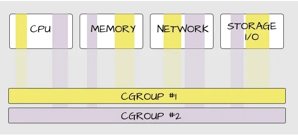
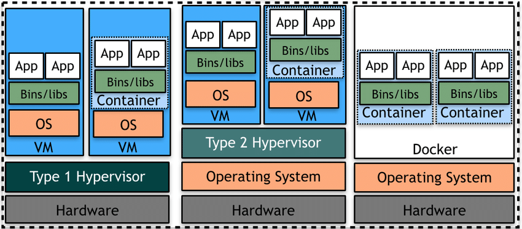
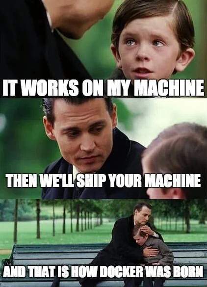
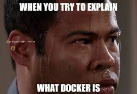

<!-- _footer:  -->

<style>
footer {
  /* Unset default placing inherited from the built-in theme */
  left: auto;
  right: auto;
  top: auto;
  bottom: auto;

  /* Place to right-bottom */
  right: 20px;
  bottom: 20px;
}
</style>

<style>
img[alt~="center"] {
  display: block;
  margin: 0 auto;
}
</style>

<!-- _footer: "" -->

# Containers 101 
### An introductory session that covers the fundamentals of containerization


Lahiru Senevirathne  
[07/03/2025]  

---

# Agenda
### Part 1: Introduction to Containerization
- What is Containerization?
- Cgroups and Namespaces
- Virtualization vs Containerization
- Benefits of Containers
- Use Cases


---
# Agenda 

### Part 2: Docker Basics
- Installing Docker
- Key Docker Concepts
- Open Container Initiative (OCI)

### Part 3: Hands-On: Running Your First Container
- Writing a Dockerfile
- Building a Docker Image
- Running a Container
- Multi-Stage Docker Builds
- Container Structure Tests and TestContainers

---

# What is Containerization?

### Definition:
Packaging an application and its dependencies together in a lightweight, portable container.

### Key Features:
- Isolation
- Portability (write once, run anywhere)
- Consistent runtime behavior


### Analogy:
Think of containers as **shipping containers** for applications: standardized, portable, and efficient.

---
# Cgroups and Namespaces
|   |   |
|---|---|

---
# Virtualization vs Containerization


---

# Benefits of Containerization

##### 1. **Portability:** Run anywhere: laptops, servers, cloud.

##### 2. **Consistency:** "Works on my machine" solved!

##### 3. **Resource Efficiency:** Lightweight compared to virtual machines.

##### 4. **Scalability:** Easily replicate and scale containers.

##### 5. **Speed:** Faster startup time.


---

# Use Cases

### 1. **DevOps Pipelines:** Automate builds, tests, and deployments.

### 2. **Microservices Architecture:** Deploy independent, scalable services.

### 3. **Cloud-native Applications:** Seamless cloud deployments.

### 4. **Local Development:** Develop in isolated environments.

---

# Installing Docker

### Manual Steps:
1. Go to [docker.com](https://www.docker.com/).
2. Download Docker Desktop for your platform.
3. Follow the installation instructions.

### Or Run the installation script:
- For Windows:
  Run Powershell as Administrator: `docker-installation/install-docker.ps1`
- For MacOS and Linux: `docker-installation/install-docker.sh`

--- 
# Installing Docker Ctd..

### Verify Installation:
```bash
docker --version
```

### Play with Docker Sandbox Environment 
Go to [labs.play-with-docker.com](https://labs.play-with-docker.com/)

---

# Key Docker Concepts

### **Images:** Blueprint for containers.

### **Containers:** Running instance of an image.

### **Dockerfile:** Instructions to build an image.
Example:
```dockerfile
FROM python:3.9
COPY app.py /app/app.py
CMD ["python", "/app/app.py"]
```

---

# Docker Commands Overview

### **Images**
List images:
```bash
docker images
```
Pull an image:
```bash
docker pull [image]
```
Build and Push an image: 
```bash
docker build -t <REPO_ADDRESS>/<REPO_NAME>/<IMAGE_NAME>:<IMAGE_TAG> .
docker push <REPO_ADDRESS>/<REPO_NAME>/<IMAGE_NAME>:<IMAGE_TAG>
```

---
# Docker Commands Overview Ctd..

### **Containers**
Run a container:
```bash
docker run [image] [other_arguments]
```
List running containers:
```bash
docker ps
```
  Stop a container:
```bash
docker stop [container_id]
```
---
# Open Container Initiative (OCI)
[opencontainers.org](https://opencontainers.org/)'s Open Container Initiative is an open governance structure for the express purpose of creating open industry standards around container formats and runtimes.

**OCI Compliant Container Image Build Tools:** [Docker](https://github.com/docker/buildx), [Buildah](https://github.com/containers/buildah), [BuildKit](https://github.com/moby/buildkit), [img](https://github.com/genuinetools/img#build-an-image)

**OCI Compliant Container Runtimes:** [Podman](https://podman.io/), [cri-o](https://cri-o.io/), [Containerd(Docker Container Runtime)](https://containerd.io/) 


---

# Hands-On: Running Your First Container

### Objective: Run a simple web server inside a container.

##### Steps:

1. Run the container: `docker run -d -p 8080:80 nginx`

2. Access the server: Open your browser and go to `http://localhost:8080`.

3. To Stop the container: 
  List Running containers by running;
 `docker ps`
  Copy the container ID and:
`docker stop [container_id]`

---

# Writing a Dockerfile

### Example: Python App
```dockerfile
# Base image
FROM python:3.9

# Copy app files
WORKDIR /app
COPY . /app

# Install dependencies
RUN pip install -r requirements.txt

# Run the application
CMD ["python", "app.py"]
```
---
# Writing a Dockerfile Ctd..
### Steps:
1. Create the Dockerfile.
2. Build the image:
```bash
docker build -t my-python-app .
```
3. Run the container:
```bash
docker run -p 5000:5000 my-python-app
```

---

# Building and Running a Docker Image

### Steps Recap:
1. **Write a Dockerfile.**
2. **Build the image:**
```bash
docker build -t [image_name] .
```
3. **Run the container:**
```bash
docker run -p [host_port]:[container_port] [image_name]
```
4. **Verify:** Open the app in your browser or API client.

---
# Building and Running a Docker Image Ctd..
### Docker Image Layers and Cache

Docker images are built using a layered approach, where each layer represents a specific set of instructions in the Dockerfile. These layers are stacked on top of each other to create the final image. 

---
# Multi-Stage Docker Builds

Multi-stage builds are useful to optimize Dockerfiles while keeping them easy to read and maintain.
```Dockerfile
FROM golang:1.23
WORKDIR /src
COPY <<EOF ./main.go
package main
import "fmt"
func main() {
  fmt.Println("hello, world")
}
EOF
RUN go build -o /bin/hello ./main.go
FROM scratch
COPY --from=0 /bin/hello /bin/hello
CMD ["/bin/hello"]
```

---
# Container Structure Tests

The Container Structure Tests provide a powerful framework to validate the structure of a container image. These tests can be used to check the output of commands in an image, as well as verify metadata and contents of the filesystem.

Github: [container-structure-test](https://github.com/GoogleContainerTools/container-structure-test)

---
# Recap

### Key Takeaways:
- What is containerization?
- Benefits of using containers.
- Basics of Docker and its components.
- How to build and run a container.
- Testing Docker Images
- Using Docker containers to test applications


---

# Thank You!

### Questions?


### Resources:
- [Docker Documentation](https://docs.docker.com/)
