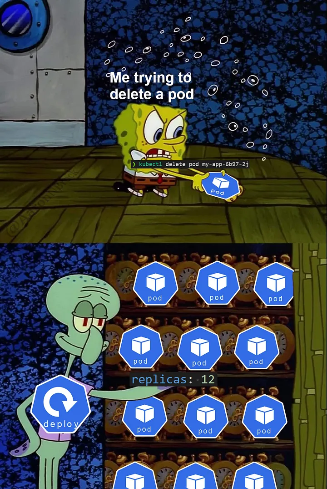

# Kubernetes 101 Workshop  
### Hands-On Session for Container Orchestration

**Instructor:** Lahiru Senevirathne
**Date:** [12/03/2025]

##### Introduction to Kubernetes, covering its core concepts, resource types, and hands-on exercises to deploy, manage, and scale containerized apps.


---

# Agenda

### Part 1: Introduction to Kubernetes
- What is Kubernetes?
- Core Concepts: Nodes, Pods, and Controllers
- Kubernetes Architecture
- Kind (Local Kubernetes cluster deployment)

### Part 2: Kubernetes Workloads
- Defining a Pod
- Deployments and ReplicaSets
- StatefulSets and DaemonSets
---
# Agenda
### Part 3: Exposing Applications
- Service Types: ClusterIP, NodePort, LoadBalancer
- Ingress Controller for HTTP Routing

### Part 4: Application Management
- Rolling Updates and Rollbacks
- Horizontal Pod Autoscaler (HPA) Demo

---

# What is Kubernetes?

### Definition:
A container orchestration platform for automating deployment, scaling, and operations of containerized applications.

### Key Features:
- Self-healing
- Automatic scaling
- Service discovery
- Load balancing

---

# Kubernetes Architecture

### Components:
- **Control Plane:** API Server, Controller Manager, Scheduler, etcd
- **Worker Nodes:** Kubelet, Kube Proxy, Container Runtime
- **Pods:** The smallest deployable unit in Kubernetes

---
# Kind

### What is Kind?
Kind (Kubernetes IN Docker) is a tool for running local Kubernetes clusters using Docker container nodes. It is primarily designed for testing and development purposes.

### Key Features:
- Runs Kubernetes clusters in Docker containers.
- Lightweight and easy to set up.
- Ideal for CI/CD pipelines and local development.

---

# Defining a Pod

### What is a Pod?
A Pod is the smallest deployable unit in Kubernetes, encapsulating one or more containers that share storage and networking.
### Example Pod YAML:
```yaml
apiVersion: v1
kind: Pod
metadata:
  name: my-first-pod
spec:
  containers:
  - name: nginx
    image: nginx
    ports:
    - containerPort: 80
```
---

### Let's deploya a Pod

Commands:
```bash
kubectl apply -f pod.yaml
kubectl get pods
kubectl describe pod my-pod
```

---

# Deployments and ReplicaSets

### What is a Deployment?
A Deployment provides declarative updates to Pods and ReplicaSets, ensuring desired state management and rollback capabilities.

---

### Example Deployment YAML:
```yaml
apiVersion: apps/v1
kind: Deployment
metadata:
  name: my-first-deployment
spec:
  replicas: 3
  selector: 
    matchLabels:
      app: my-app
  template:
    metadata:
      labels:
        app: my-app
    spec:
      containers:
      - name: app
        image: nginx
```

---

### Let's create a deployment

Commands:
```bash
kubectl apply -f deployment.yaml
kubectl get deployments
kubectl describe deployment my-deployment
```

---
# Pod vs Deployment

### **Pod:**
- A single instance of a running process in a cluster.
- Can contain one or more tightly coupled containers.
- Manually managed and not self-healing.

### **Deployment:**
- Manages multiple replicas of Pods.
- Provides rollout, rollback, and self-healing capabilities.
- Ensures desired state of application using ReplicaSets.
<!--  -->

--- 

# Pod vs Deployment Ctd..

### **Key Differences:**
| Feature            | Pod                               | Deployment                          |
| ------------------ | --------------------------------- | ----------------------------------- |
| Number of replicas | 1                                 | Multiple (via ReplicaSet)           |
| Self-healing       | No                                | Yes                                 |
| Rollback support   | No                                | Yes                                 |
| Use case           | Single-instance apps or debugging | Scalable and resilient applications |

---

# StatefulSets and DaemonSets

## StatefulSets
### What is a StatefulSet?
A StatefulSet manages the deployment and scaling of a set of Pods while maintaining a unique identity for each Pod.

### Use Cases:
- Databases (MySQL, PostgreSQL, etc.)
- Distributed systems (Kafka, Zookeeper, etc.)
- Applications requiring persistent storage and stable network identity
  
---

## DaemonSets
### What is a DaemonSet?
A DaemonSet ensures that a copy of a Pod runs on all (or some) nodes in a cluster.

### Use Cases:
- Logging agents (Fluentd, Logstash)
- Monitoring agents (Prometheus Node Exporter)
- Networking tools (CNI plugins, kube-proxy)

---

# Exposing Applications

### Service Types:
1. **ClusterIP** (default, internal only)
2. **NodePort** (exposes service on a node port)
3. **LoadBalancer** (integrates with cloud provider LB)

---

### Example Service YAML:
```yaml
apiVersion: v1
kind: Service
metadata:
  name: my-first-service
spec:
  selector:
    app: my-app
  ports:
    - protocol: TCP
      port: 80
      targetPort: 80
```
### Let's create a service to expose the app
```bash
kubectl apply -f service.yaml
kubectl get svc
```
--- 
### Accessing the service via the Cluster IP
```bash
kubectl run -it --rm debugger --image=busybox -- /bin/bash
```
```bash
curl my-first-service.app.svc.cluster.local:5000
```

### Accessing via NodePort
```bash
curl localhost:30950
```
---
### Accessing via LoadBalancer

Find the host port mapped to the loadbalancer port (Only for mac and WSL2 because bridge network is not accessible from the host)

- List the running docker containers and find the container name starting with `kindccm`  
- Find the port port mapped to the service port.
```bash 
curl localhost:<MAPPED_PORT>
```
---

# Rolling Updates & Rollbacks

### Update Deployment:
```bash
kubectl set image deployment/my-first-deployment app=docker.io/library/my-first-app:v1
kubectl rollout status deployment/my-first-deployment
```

### Rollback:
```bash
kubectl rollout undo deployment/my-first-deployment
```

---

# Autoscaling Apps

### Install Metrics Server
Run the script: `bash kind-installation/install-metrics-server.sh`

---
### Configure Horizontal Pod Autoscaler (HPA)
```yaml
apiVersion: autoscaling/v2
kind: HorizontalPodAutoscaler
metadata:
  name: my-first-hpa
spec:
  scaleTargetRef:
    apiVersion: apps/v1
    kind: Deployment
    name: my-first-deployment
  minReplicas: 2
  maxReplicas: 10
  metrics:
  - type: Resource
    resource:
      name: cpu
      target:
        type: Utilization
        averageUtilization: 50
```
---
### Apply HPA
```bash
kubectl apply -f hpa.yaml
kubectl get hpa
```

### Generate Traffic to Observe Scaling Behavior

Spin-up a temporary pod to generate traffic:
```bash
kubectl run -it --rm load-generator --image=busybox -- /bin/sh
while true; do wget -q -O- http://nginx-service.default.svc.cluster.local; done
```
Or, use Apache bench use the Loadbalancer localhost endpoint
```bash
ab -n 10000000 -c 25 http://localhost:<LB_MAPPED_PORT>/
```
---

### Monitor the HPA scaling behavior
```bash
kubectl get hpa
kubectl get pods
```

---

# Thank You!

### Questions?

### Resources:
- [Kubernetes Documentation](https://kubernetes.io/docs/)
- [Your GitHub Repo or Slides]
